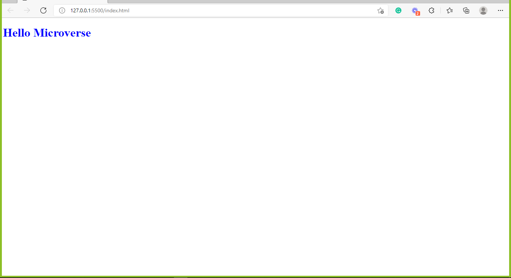

# Hello-Microverse-Project
# This is a linters setup project

## Description
> My first Microverse project which is Setting up linters.

## Built With

- html
- css

## Procedure to clone project
- open your terminal
- type git clone https://github.com/aeon9300/Hello-Microverse-Project
- run the project in your local machine
- Run the project in you browser 
- Inspect it to check the look in mobile format.

## Author

👤 *Adebisi Ayodele Samuel*

- GitHub: [@githubhandle](https://github.com/aeon9300)
- Twitter: [@twitterhandle](https://twitter.com/aeon9300)
- LinkedIn: [LinkedIn](https://www.linkedin.com/in/samuel-adebisi-4a589362/)

## 🤝 Contributing

Contributions, issues, and feature requests are welcome!

Feel free to check the [issues page](../../issues/).

## Show your support

Give a ⭐ if you like this project!

## 📝 License

This project is [MIT](./MIT.md) licensed.
